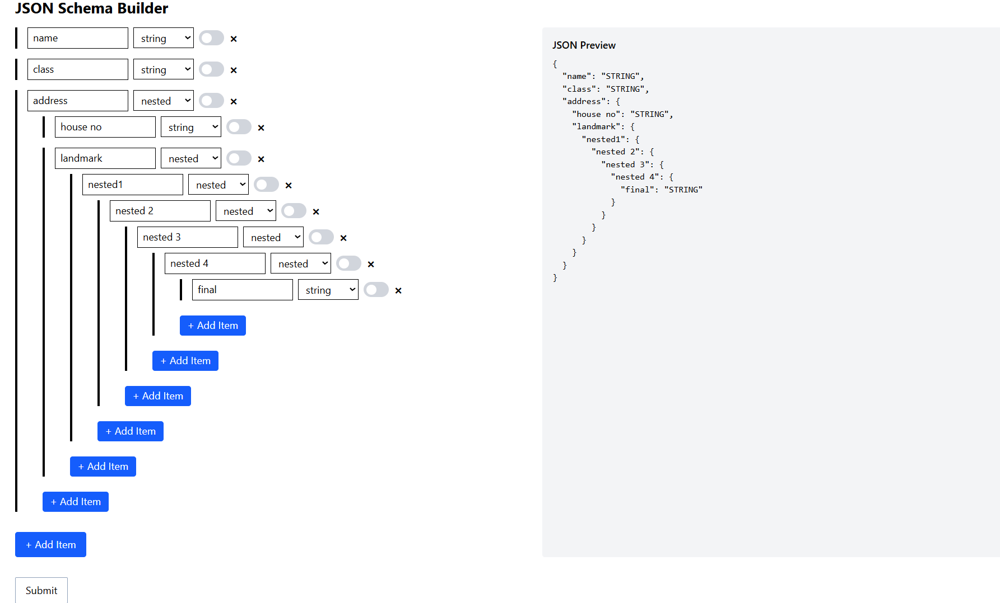

# 🛠️ JSON Schema Builder (React + Vite + Tailwind)

Welcome to **JSON Schema Builder** – a modern, interactive tool for visually designing JSON schemas. Built with React, Vite, and TailwindCSS, this project lets you create, preview, and manage complex JSON structures with ease.

---

## 🚀 Features

- **Visual Schema Creation:** Add, edit, and nest fields to build JSON schemas interactively.
- **Live Preview:** Instantly see your schema as formatted JSON.
- **Field Types:** Supports string, number, float, boolean, objectId, array, and nested objects.
- **Required Toggle:** Mark fields as required with a simple switch.
- **Responsive UI:** Clean, mobile-friendly interface powered by TailwindCSS.
- **Easy Extensibility:** Modular React components for rapid customization.

---

## 📖 Definitions

- **Field:** A key-value pair in the schema, with type and required status.
- **Nested Field:** A field containing child fields, representing objects within objects.
- **Array:** A field representing a list of items.
- **Preview:** Real-time display of the schema in JSON format.

---

## 📖 Screenshot


---

## 🧑‍💻 Tech Stack

- **React 19:** UI library for building interactive interfaces.
- **Vite:** Lightning-fast development server and build tool.
- **TailwindCSS 4:** Utility-first CSS framework for rapid styling.

---

## 📦 Dependencies

Main dependencies (see [`package.json`](package.json)):
- `react`
- `react-dom`
- `@vitejs/plugin-react`
- `tailwindcss`
- `@tailwindcss/vite`
- `eslint`
- `eslint-plugin-react-hooks`
- `eslint-plugin-react-refresh`
- `globals`

---

## 📁 Folder Structure

```
├── .gitignore
├── eslint.config.js
├── index.html
├── package.json
├── README.md
├── vite.config.js
├── public/
├── src/
│   ├── App.jsx
│   ├── index.css
│   ├── main.jsx
│   └── components/
│       ├── Field.jsx
│       ├── JsonBuilder.jsx
│       └── JsonPreview.jsx
```

- **App.jsx:** Main application entry, renders the builder.
- **main.jsx:** React root setup.
- **index.css:** TailwindCSS import.
- **components/**
  - **Field.jsx:** Field editor (type, key, required, nested).
  - **JsonBuilder.jsx:** Manages fields and schema logic.
  - **JsonPreview.jsx:** Displays live JSON output.

---

## 🌟 Highlights

- **Intuitive:** No coding required to build complex JSON schemas.
- **Modular:** Easily extend or integrate with other tools.
- **Fast:** Instant feedback and blazing development speed.
- **Open Source:** Ready for customization and contributions.

---

## 🏁 Getting Started

1. **Install dependencies:**  
   `npm install`
2. **Start development server:**  
   `npm run dev`
3. **Open in browser:**  
   Visit `http://localhost:5173` (default Vite port).

---

## 🤝 Contributing

Pull requests and suggestions are welcome! Feel free to fork, star, and improve the project.


---

> **Built with using React, Vite, and TailwindCSS.**
